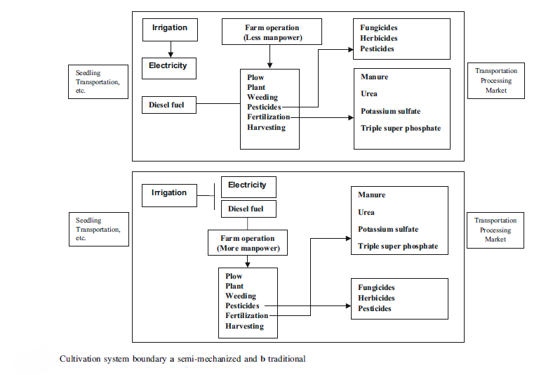
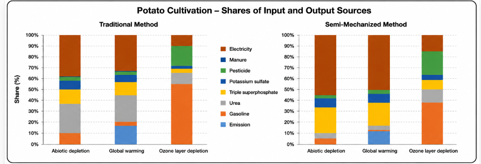

# Comparative Life Cycle Assessment of Potato Cultivation Systems

**Peer-reviewed LCA | Primary Data from 120 Farms | Agricultural LCI | Cultivation-System Comparison | SimaPro | ecoinvent**

This repository provides a concise technical summary of my peer-reviewed comparative life cycle assessment of potato cultivation systems.

> Shahmohammadi, A., Veisi, H., & Khoshbakht, K. (2018).  
> *Comparative life cycle assessment of mechanized and semi-mechanized methods of potato cultivation.*  
> Energy, Ecology and Environment, 3(5), 288–295.  
> https://doi.org/10.1007/s40974-018-0099-6

---

## Research Question

How does the level and form of agricultural mechanization affect the environmental performance of potato production?

The study compared alternative cultivation systems using primary farm-level inventory data and life cycle assessment.

---

## LCA Design

| Element | Study design |
|---|---|
| Functional unit | 1 tonne of potatoes |
| System boundary | Farm gate |
| Primary data | 120 farm questionnaires |
| Farm groups | 60 semi-mechanized + 60 traditional |
| Background data | ecoinvent |
| Software | SimaPro 8.0.4 |
| LCIA method | CML 2 Baseline 2000 |
| Main impact categories | GWP, abiotic depletion and ozone depletion |

---

## Primary Life Cycle Inventory

A key strength of this study was the development of a foreground life cycle inventory based on primary farm data.

Data were collected through face-to-face questionnaires from 120 potato farms, including 60 semi-mechanized and 60 traditional farms.

The primary inventory covered:

irrigation water
electricity and fuel use
manure
urea
triple superphosphate
potassium sulfate
pesticides
farm operations

Where direct measurement of environmental emissions was not feasible, the study applied established emission-factor methods from the scientific literature.

Primary farm data were then complemented with ecoinvent background data for upstream processes such as agricultural input production and energy carriers.

This makes the study useful not only as a comparative LCA, but also as an example of building an LCI from field data and linking it with secondary background databases.

---

## System Boundary

The farm-gate boundary included activities such as:

**land preparation → planting → irrigation → fertilization → pesticide application → harvesting**

Downstream processing and market activities were outside the defined system boundary.

---

## Key Results

Reported environmental impacts per tonne of potato were:

| Impact category | Semi-mechanized | Traditional |
|---|---:|---:|
| Global warming potential | 227.56 kg CO2e | 152.89 kg CO2e |
| Abiotic depletion | 1.71 kg Sb eq | 1.11 kg Sb eq |
| Ozone depletion | 0.00004 kg CFC-11 eq | 0.00005 kg CFC-11 eq |

The results demonstrate that mechanization does not automatically improve every environmental indicator.

---

## Contribution / Hotspot Analysis

Contribution analysis showed that environmental performance was driven by different inputs across the two production systems.

Important contributors included:

- electricity
- diesel/fuel
- fertilizers
- pesticides
- field emissions

Electricity and fertilizer production were particularly important contributors in the semi-mechanized system, while higher diesel use was an important factor in the traditional system.

---

## Interpretation

The study illustrates a recurring LCA issue:

> Technology changes frequently shift environmental burdens rather than simply eliminating them.

Mechanization can improve some aspects of production efficiency while increasing energy or material demands elsewhere.

The results therefore support targeted interventions such as:

- improved irrigation efficiency
- optimized fertilizer application
- more efficient agricultural machinery
- lower-carbon energy supply
- improved input-management practices

rather than assuming that either traditional or more mechanized production is universally superior.

---

## What This Work Demonstrates

This peer-reviewed research demonstrates experience with:

**Research Design → Primary Data Collection → Functional Unit → Boundary → LCI → LCIA → Contribution Analysis → Interpretation**

Specific capabilities include:

- agricultural LCA
- primary foreground-data collection
- questionnaire-based inventory development
- emission-factor application
- SimaPro modeling
- ecoinvent background data
- comparative production-system analysis
- hotspot identification
- interpretation of technology/resource tradeoffs

---

## Publication

Shahmohammadi, A., Veisi, H., & Khoshbakht, K. (2018).

*Comparative life cycle assessment of mechanized and semi-mechanized methods of potato cultivation.*

**Energy, Ecology and Environment, 3(5), 288–295.**

https://doi.org/10.1007/s40974-018-0099-6

---

## Related Work

See my broader **Life Cycle Assessment Portfolio** for peer-reviewed research and applied work spanning aquaculture, agriculture, renewable fuels, construction materials, packaging, EPD methodology and decision analytics.
